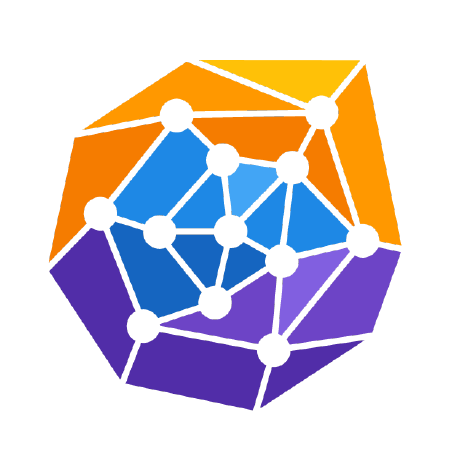

### Research interests
<ul style="list-style-type: none; padding-left: 15px;">
  <li>🤖 Reinforcement learning</li>
  <li>⚙️ Optimization</li>
  <li>🎨 Generative models</li>
  <li> Geometric deep learning</li>
</ul>

### Other interests
<ul style="list-style-type: none; padding-left: 15px;">
  <li>⚡ Electricity systems</li>
  <li>⚛️ Nuclear energy</li>
  <li>📈 Energy markets</li>
  <li>🌍 Climate studies</li>
  <li>🧬 Computational biology</li>
  <li>📜 History of science</li>
</ul>
