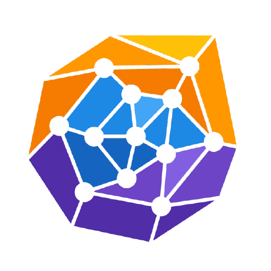

### Research interests
* Reinforcement learning 🤖
* Optimization ⚙️
* Generative models 🎨
* Geometric deep learning 

### Other interests
* Electricity systems ⚡
* Nuclear energy ⚛️
* Energy markets 📈
* Climate studies 🌍
* Computational biology 🧬
* History of science 📜